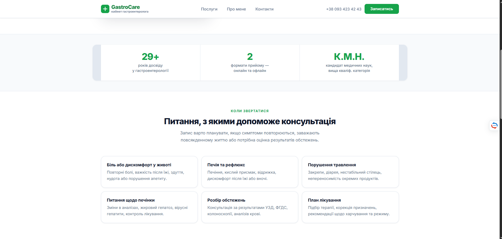
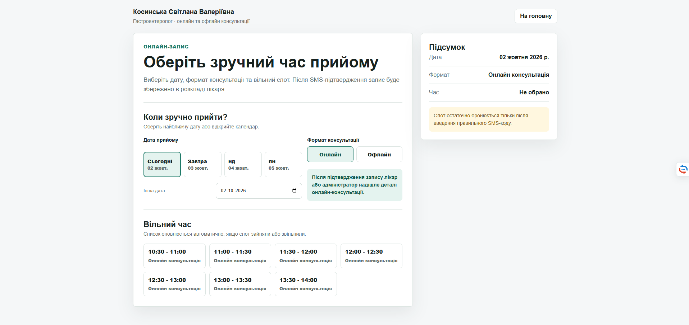
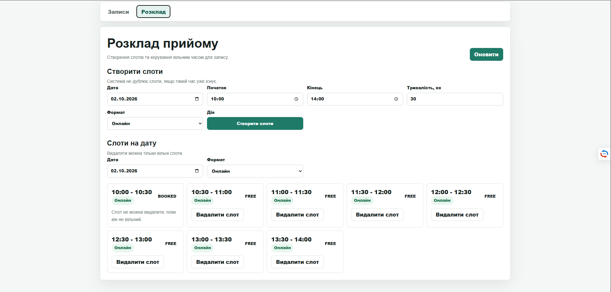
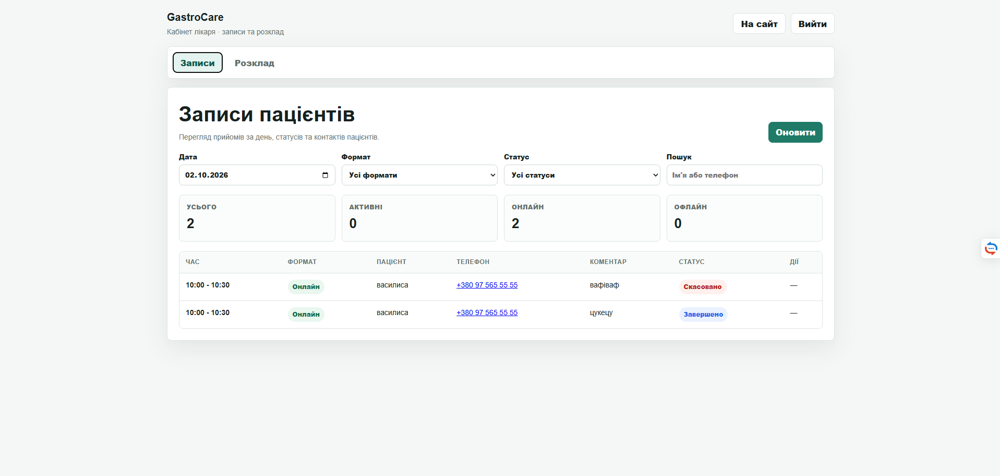
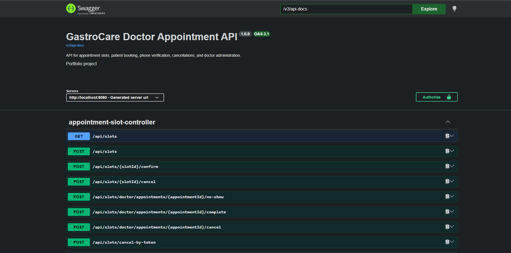

# GastroCare Doctor Appointment System

GastroCare is a Spring Boot appointment booking system for a doctor who accepts online and offline consultations. Patients can choose a date, appointment type and free time slot, verify their phone number with an SMS code, and cancel an appointment by token. The doctor has a protected dashboard for managing appointments and schedule slots.

## Features

- Public landing page for a gastroenterologist
- Online and offline appointment booking
- PostgreSQL persistence with Flyway migrations
- SMS verification flow through TurboSMS integration
- Appointment cancellation by secure token link
- Doctor dashboard with protected access
- Appointment filters by date, type, status and patient search
- Schedule slot creation and deletion
- Real-time slot updates through WebSocket/STOMP
- Unified JSON error responses for API failures

## Tech Stack

- Java 21
- Spring Boot 3.5
- Spring Web
- Spring Data JPA
- Spring Security
- PostgreSQL
- Flyway
- WebSocket/STOMP
- Maven
- Docker Compose
- OpenAPI/Swagger UI

## Main Pages

- `/` - public landing page
- `/booking.html` - patient booking page
- `/cancel.html?token=...` - appointment cancellation page
- `/admin-login.html` - doctor login
- `/doctor.html` - doctor dashboard

## Demo Login

Default local doctor password:

```text
12345
```

For real deployment, replace `DOCTOR_ADMIN_PASSWORD_HASH` with a new BCrypt hash.

## Run With Docker Compose

Copy the example env file:

```bash
cp .env.example .env
```

Start PostgreSQL and the application:

```bash
docker compose up --build
```

Open:

```text
http://localhost:8080
```

API documentation:

```text
http://localhost:8080/swagger-ui.html
http://localhost:8080/v3/api-docs
```

## Run Locally Without Docker

Start PostgreSQL locally and create a database named `med_schedule`, then set environment variables or use the defaults from `application.properties`.

Run:

```bash
./mvnw spring-boot:run
```

On Windows:

```powershell
.\mvnw.cmd spring-boot:run
```

## Environment Variables

| Variable | Purpose |
| --- | --- |
| `DATABASE_URL` | JDBC URL for PostgreSQL |
| `DATABASE_USERNAME` | Database user |
| `DATABASE_PASSWORD` | Database password |
| `APP_BASE_URL` | Public base URL used in SMS cancellation links |
| `DOCTOR_ADMIN_PASSWORD_HASH` | BCrypt hash for doctor login |
| `DOCTOR_ADMIN_COOKIE_SECURE` | Set `true` behind HTTPS |
| `TURBOSMS_ENABLED` | Enables real SMS sending |
| `TURBOSMS_API_TOKEN` | TurboSMS API token |
| `TURBOSMS_SMS_SENDER` | TurboSMS sender name |

## Tests

Run:

```bash
./mvnw test
```

On Windows:

```powershell
.\mvnw.cmd test
```

## Screenshots

### Home Page



### Booking Page



### Doctor Page




### Swagger API Docs



## Project Notes

This project is designed as a portfolio-ready Spring Boot application. The core booking flow is implemented server-side, while the frontend is served as static HTML/CSS/JavaScript from Spring Boot.

Recommended production steps:

- replace demo admin password hash;
- enable HTTPS and `DOCTOR_ADMIN_COOKIE_SECURE=true`;
- configure real TurboSMS credentials;
- run with a managed PostgreSQL instance;
- add monitoring and backups.
