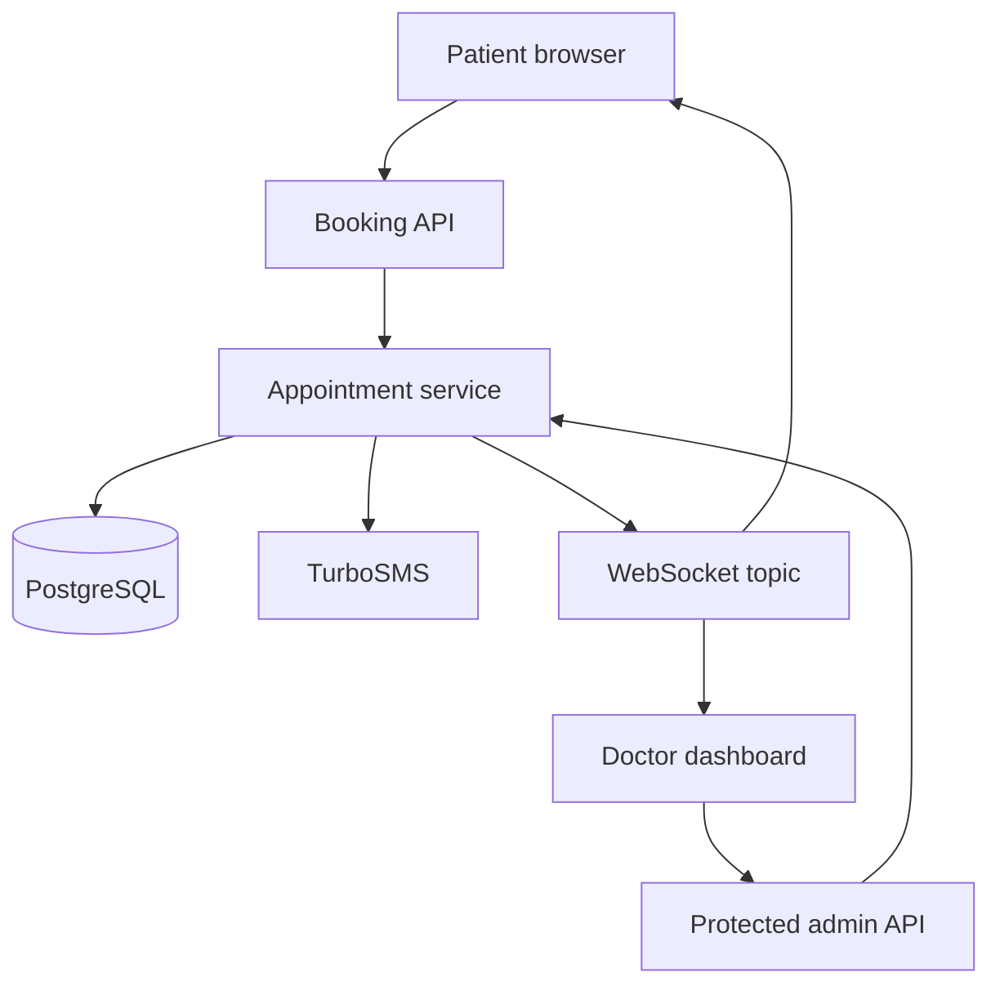

# GastroCare — Doctor Appointment Booking System

> A production-style Spring Boot application for managing online and in-clinic doctor appointments. It provides a public patient booking flow, SMS phone verification, secure self-service cancellation, real-time availability updates, and a protected doctor workspace.

## Why this project

GastroCare models the parts of an appointment system where correctness matters: preventing double bookings, verifying a patient's phone before confirmation, restricting each phone number to one active appointment, and keeping the schedule up to date for all connected clients.

## Key features

- **Public booking flow** for `ONLINE` and `OFFLINE` consultations; patients do not need an account.
- **SMS one-time-password verification** through TurboSMS, with a safe local mock mode.
- **Race-safe booking:** an atomic database update changes a slot from `FREE` to `BOOKED`; a competing request receives a clear “slot already taken” response.
- **One active booking per patient phone:** phone numbers are normalized and protected by both application logic and a partial database unique index.
- **Secure cancellation links:** a patient can cancel their own active appointment using an unguessable token sent in the confirmation message.
- **Protected doctor dashboard** for schedule creation, appointment review, cancellation, completion, and no-show handling.
- **Real-time schedule updates** through WebSocket/STOMP and SockJS.
- **Database-first evolution** with versioned Flyway migrations.
- **Validation and abuse controls:** request validation, Ukrainian phone validation, OTP expiry, SMS resend limits, BCrypt password verification, database-backed admin sessions, and login-attempt throttling by IP.
- **OpenAPI documentation** and automated unit/integration tests.

## Architecture



## Booking flow

1. The patient selects a date, appointment type, and a free slot.
2. The client requests a six-digit verification code for a Ukrainian phone number.
3. The patient submits their details and the OTP to confirm the selected slot.
4. The backend validates the phone, code expiry, and the “one active appointment per phone” rule.
5. A guarded `FREE → BOOKED` database update makes the first confirmation win and prevents double booking.
6. The application creates the appointment, sends an SMS confirmation with a cancellation URL, and broadcasts the schedule update through `/topic/slots`.

## Tech stack

| Area | Technologies |
| --- | --- |
| Language & framework | Java 21, Spring Boot 3.5.14 |
| Web & API | Spring MVC, Jakarta Validation, REST, Springdoc OpenAPI |
| Persistence | Spring Data JPA, PostgreSQL 17, Flyway |
| Security | Spring Security, BCrypt, HTTP-only session cookie, server-side admin sessions |
| Real-time | Spring WebSocket, STOMP, SockJS |
| Messaging | TurboSMS API with a local mock provider |
| Testing | JUnit 5, Mockito, MockMvc, H2 |
| Delivery | Maven Wrapper, Docker, Docker Compose |

## Pages

| Page | Purpose |
| --- | --- |
| `/` | Public doctor landing page |
| `/booking.html` | Patient appointment flow |
| `/cancel.html?token=...` | Patient self-service cancellation |
| `/admin-login.html` | Doctor login page |
| `/doctor.html` | Doctor appointments dashboard |
| `/doctor-slots.html` | Doctor schedule management |
| `/swagger-ui.html` | Interactive API documentation |

## API overview

| Endpoint | Access | Purpose |
| --- | --- | --- |
| `GET /api/slots?date=...&type=ONLINE|OFFLINE` | Public | List slots for a date and consultation type |
| `POST /api/phone/send-code` | Public | Send a verification code to a phone number |
| `POST /api/slots/{slotId}/confirm` | Public | Confirm an available slot with a phone verification code |
| `GET /api/slots/cancel-info?token=...` | Public | Show appointment information before cancellation |
| `POST /api/slots/cancel-by-token?token=...` | Public | Cancel an appointment using its secure token |
| `POST /api/admin/auth/login` | Public | Authenticate the doctor and issue a session cookie |
| `GET /api/slots/doctor/appointments?date=...` | Doctor | Review daily appointments |
| `POST /api/slots` | Doctor | Create time slots for a day |
| `DELETE /api/slots/{slotId}` | Doctor | Delete a free slot |
| `POST /api/slots/doctor/appointments/{id}/complete` | Doctor | Mark an appointment as completed |
| `POST /api/slots/doctor/appointments/{id}/cancel` | Doctor | Cancel an appointment from the dashboard |
| `POST /api/slots/doctor/appointments/{id}/no-show` | Doctor | Mark an appointment as a no-show |

The WebSocket endpoint is `/ws`; clients subscribe to `/topic/slots` for live slot-status changes.

## Run with Docker Compose

### Prerequisites

- Docker Engine with Docker Compose v2

### 1. Create local environment configuration

```bash
cp .env.example .env
```

Update the values in `.env`, especially database credentials, the doctor password hash, and `APP_BASE_URL` before a real deployment. `.env` is ignored by Git.

### 2. Start the application

```bash
docker compose up --build
```

Open the application at [http://localhost:8080](http://localhost:8080).

The default PostgreSQL port from `.env.example` is `5434`, which avoids conflicts with a locally installed PostgreSQL instance.

### Stop the stack

```bash
docker compose down
```

To also delete the local database volume (destructive):

```bash
docker compose down -v
```

## Run locally without Docker

### Prerequisites

- JDK 21
- PostgreSQL 17 (or a compatible PostgreSQL version)

Create the `med_schedule` database, configure the `DATABASE_*` variables if necessary, then run:

```bash
bash mvnw spring-boot:run
```

On Windows:

```powershell
.\mvnw.cmd spring-boot:run
```

Flyway applies the versioned schema migrations automatically at startup. The application uses `ddl-auto=validate`, so the schema remains controlled by migrations rather than Hibernate auto-generation.

## Configuration

| Variable | Purpose | Local default |
| --- | --- | --- |
| `DATABASE_URL` | PostgreSQL JDBC URL | `jdbc:postgresql://localhost:5432/med_schedule` |
| `DATABASE_USERNAME` | Database user | `myuser2` |
| `DATABASE_PASSWORD` | Database password | — |
| `APP_BASE_URL` | Base URL embedded in SMS cancellation links | `http://localhost:8080` |
| `DOCTOR_ADMIN_PASSWORD_HASH` | BCrypt hash used for doctor login | Demo hash for password `12345` |
| `DOCTOR_ADMIN_COOKIE_SECURE` | Enables the cookie `Secure` attribute behind HTTPS | `false` |
| `TURBOSMS_ENABLED` | Sends real SMS messages when `true` | `false` |
| `TURBOSMS_API_TOKEN` | TurboSMS API token | — |
| `TURBOSMS_SMS_SENDER` | TurboSMS sender name | — |

When `TURBOSMS_ENABLED=false`, SMS messages are written to application logs instead of being sent. This keeps the complete booking flow testable without third-party credentials.

## Testing

Run all tests:

```bash
bash mvnw test
```

On Windows:

```powershell
.\mvnw.cmd test
```

The test suite includes:

- unit tests for phone normalization and slot-creation validation;
- Mockito tests for schedule generation;
- a MockMvc + H2 integration test that authenticates the doctor, creates slots, sends an OTP, confirms an appointment, cancels it by token, and checks the OpenAPI document.

## Screenshots

### Public landing page


### Patient booking flow


### Doctor workspace


### Swagger UI


## Project structure

```text
src/main/java/.../
├── config/          # Security, WebSocket, CORS, OpenAPI configuration
├── controller/      # Patient, phone verification, and doctor API endpoints
├── dto/             # Request and response contracts
├── entity/          # JPA domain model and status enums
├── repository/      # Spring Data repositories and guarded update queries
├── service/         # Booking flow, OTP, notifications, and login throttling
└── util/            # Phone validation and normalization

src/main/resources/
├── db/migration/    # Versioned Flyway migrations
└── static/          # Landing page, booking, cancellation, and doctor UI
```

## Production considerations

This is a portfolio project, but the next steps for a real medical deployment would be:

- store the doctor password hash and TurboSMS token in a secret manager;
- run behind HTTPS with `DOCTOR_ADMIN_COOKIE_SECURE=true`;
- configure trusted proxy handling before relying on `X-Forwarded-For` for login throttling;
- add audit logging, backups, monitoring, and alerting;
- move WebSocket messaging and login-attempt tracking to shared infrastructure when running multiple application instances;
- add consent, retention, and access-control policies appropriate for real patient data.

## What this project demonstrates

This project demonstrates practical Java backend development with Spring Boot, layered REST design, JPA and PostgreSQL schema migrations, concurrency-safe state transitions, Spring Security, session-based authentication, real-time WebSocket communication, third-party API integration, Dockerized local development, and automated testing.
